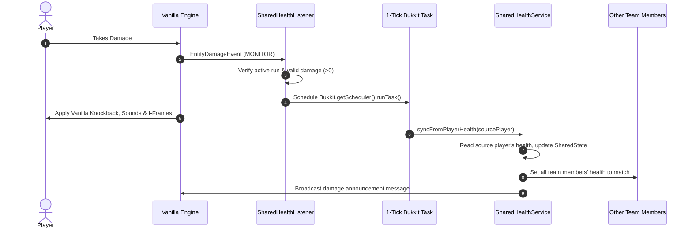
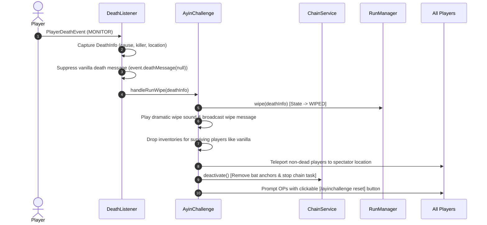
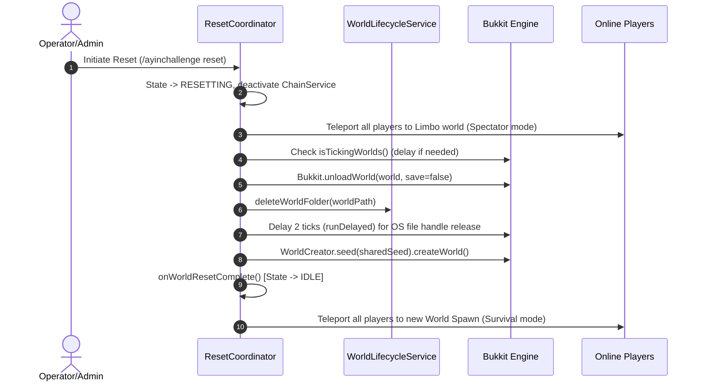

# Event & Task Flow Documentation

This document maps all Bukkit event listeners, scheduled tasks, and system triggers in **AyinChallenge**, describing how events flow through services to drive gameplay behavior.

---

## 1. Listener Map

| Listener | Event | Priority | Triggered Action / Behavior |
| :--- | :--- | :--- | :--- |
| **RunListener** | `PlayerJoinEvent` | MONITOR | Updates death count in UI; refreshes attempt boss bar; auto-joins player to run if enabled; syncs health if run is active; teleports to Limbo if state is `RESETTING`. |
| **RunListener** | `BlockBreakEvent` | NORMAL | Cancels block breaking if `RunState` is not `RUNNING` in challenge worlds. |
| **RunListener** | `BlockPlaceEvent` | NORMAL | Cancels block placement if `RunState` is not `RUNNING` in challenge worlds. |
| **RunListener** | `PlayerInteractEvent` | NORMAL | Cancels interactions if `RunState` is not `RUNNING` in challenge worlds. |
| **RunListener** | `EntityDamageByEntityEvent` | NORMAL | Cancels PvP damage if `RunState` is not `RUNNING` in challenge worlds. |
| **RunListener** | `EntityDamageEvent` | NORMAL | Tracks damage taken by run participants via `RunStatsService`; cancels environment damage if `RunState` is not `RUNNING`. |
| **RunListener** | `FoodLevelChangeEvent` | NORMAL | Cancels food level loss if `RunState` is not `RUNNING`. |
| **RunListener** | `EntityExhaustionEvent` | NORMAL | Cancels hunger exhaustion if `RunState` is not `RUNNING`. |
| **RunListener** | `PlayerQuitEvent` | MONITOR | Removes player from participant list in `RunManager`. |
| **RunListener** | `PlayerChangedWorldEvent` | MONITOR | Configures hardcore mode and immediate respawn rules when entering challenge worlds; adds or removes player from participants; refreshes UI. |
| **RunListener** | `PlayerPostRespawnEvent` | MONITOR | Re-syncs shared team health after player respawns during active run. |
| **RunListener** | `EntityDamageEvent` | NORMAL (`ignoreCancelled=true`) | Cancels damage targeted at chain anchor bats (`ayinchallenge_chain_anchor`). |
| **RunListener** | `PlayerInteractEntityEvent` | NORMAL (`ignoreCancelled=true`) | Cancels right-click interactions on chain anchor bats. |
| **RunListener** | `EntityUnleashEvent` | HIGHEST | Cancels leash dropping on chain anchor bats to keep tether visual intact. |
| **SharedHealthListener** | `EntityDamageEvent` | MONITOR (`ignoreCancelled=true`) | Defers health synchronization by 1 tick via `runTask()` to preserve vanilla hit immunity/knockback, then syncs health across all team participants and broadcasts damage. |
| **SharedHealthListener** | `EntityRegainHealthEvent` | MONITOR (`ignoreCancelled=true`) | Cancels vanilla natural regeneration (`SATIATED`, `REGEN`) to prevent exhaustion leaks; defers potion/apple heal sync to `SharedHealthService`. |
| **SharedHealthListener** | `EntityResurrectEvent` | MONITOR (`ignoreCancelled=true`) | Defers health sync after Totem of Undying activation. |
| **DeathListener** | `PlayerDeathEvent` | MONITOR | Cancels default death message; captures `DeathInfo` (killer, cause, location); triggers `AyinChallenge.handleRunWipe(info)`. |
| **RedirectionListener** | `EntityPortalEvent` | LOWEST | Redirects entity portal transitions targeted at `minecraft:overworld` to the plugin's fake overworld. |
| **RedirectionListener** | `PlayerPortalEvent` | LOWEST | Redirects player portal transitions targeted at `minecraft:overworld` to the plugin's fake overworld (or spawn if coming from End portal). |
| **RedirectionListener** | `PlayerJoinEvent` | LOWEST | Teleports joining players out of the real overworld to the fake overworld spawn. |
| **RedirectionListener** | `PlayerRespawnEvent` | LOWEST | Forces spectator respawn at death location during `WIPED` state; redirects overworld respawns to fake overworld spawn. |
| **RunFinishDetector** | `EntityDeathEvent` | NORMAL | Detects Ender Dragon death; flags run finish and schedules final completion logic 10 seconds later. |

---

## 2. Scheduled Task Map

| Task Owner | Schedule Type | Interval | Behavior / Purpose |
| :--- | :--- | :--- | :--- |
| **ChainService** | `runTaskTimer` (Sync) | 1 tick (20 Hz) | Updates invisible bat anchor entities at players' waist level, maintains leash connections between sequential players, and computes distance-squared tether physics to pull players together when exceeding max distance threshold. |
| **SharedHealthService** | `runTaskTimer` (Sync) | 10 ticks (0.5s) | Replaces vanilla natural regeneration heartbeat. Checks for food/saturation levels among participants, applies team healing, applies 6.0 exhaustion to the sponsor player, and updates UI sponsor indicator. |
| **SpeedrunTimerService** | `runTaskTimer` (Sync) | 1 tick (20 Hz) | Updates action bar timer displays, tab list header/footer, attempt count boss bar, and player list scoreboards. |
| **LobbyService (Time Lock)** | `runTaskTimer` (Sync) | 10 ticks (0.5s) | Locks lobby world time to `0` ticks while in `IDLE`, `STARTING`, or `RESETTING` state. |
| **LobbyService (Countdown)** | `runTaskTimer` (Sync) | 20 ticks (1.0s) | Plays countdown sounds and displays title countdown before expanding world border and calling `RunManager.start()`. |
| **RunFinishDetector** | `runTaskLater` (Sync) | 200 ticks (10s) | Delayed task triggered after Dragon death to allow death animation to finish before finalizing run time and broadcasting victory. |
| **ResetCoordinator** | `runDelayed` (Global Region) | 1 to 2 ticks | Asynchronous delay steps for unloading worlds, releasing OS file locks, and re-creating seeded worlds. |

---

## 3. End-to-End Event Sequences

### Scenario A: Player Takes Damage

### Scenario B: Player Dies (Run Wipe Sequence)

### Scenario C: World Reset Sequence

