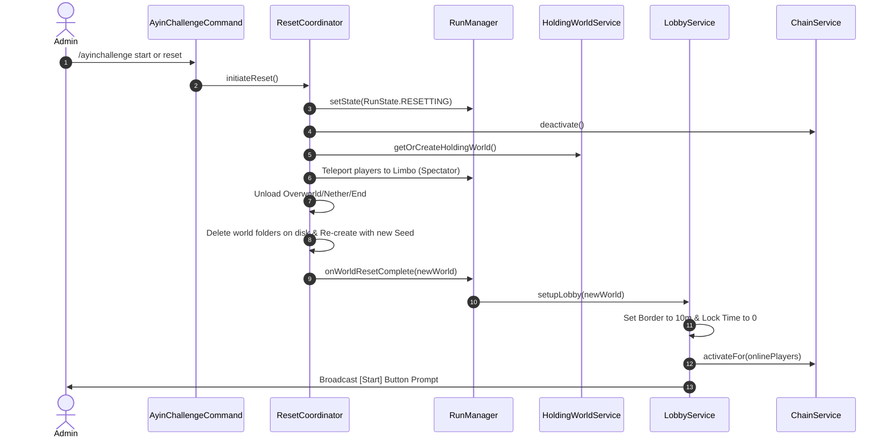
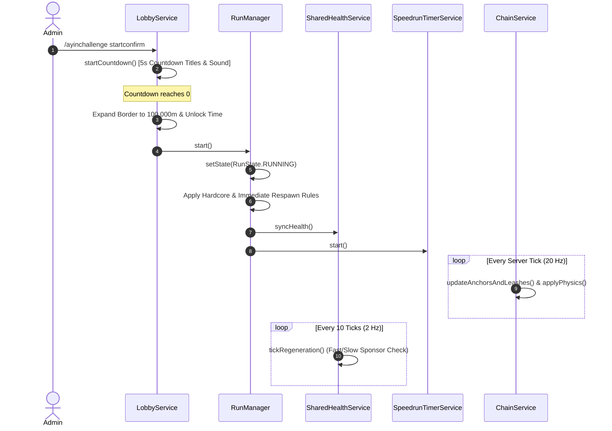
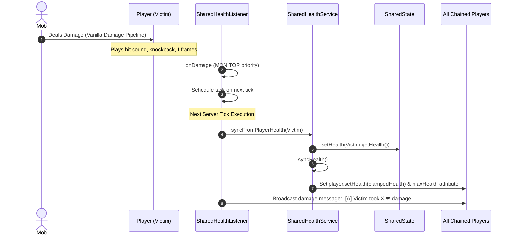
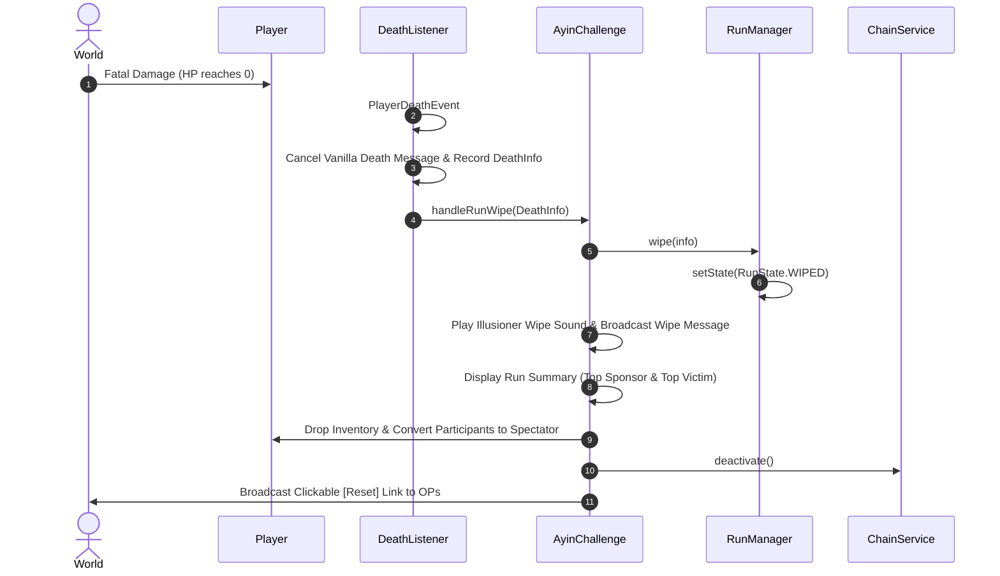

# System Overview & Architecture

This document provides a high-level architectural overview and runtime flow analysis for the AyinChallenge plugin.

---

## 1. Component Sitemap & Responsibilities

```
me.ayinaki.ayinchallenge
│
├── AyinChallenge.java            # Main JavaPlugin entrypoint; service container & lifecycle initialization
│
├── chain/
│   └── ChainService.java         # Chain order management, bat anchor spawning, leash updating, physics pull calculations
│
├── health/
│   └── SharedHealthService.java  # Team shared health sync pool & custom 10-tick food/saturation heartbeat task
│
├── run/
│   ├── RunManager.java           # Central run state engine, gamerule manager, participant set, persistence
│   ├── RunState.java             # Enum: IDLE, RUNNING, STARTING, FINISHED, WIPED, RESETTING
│   └── SharedState.java          # Thread-safe synchronized health & max-health state container
│
├── reset/
│   ├── ResetCoordinator.java     # Synchronous world unload, file deletion, and re-creation pipeline
│   ├── WorldLifecycleService.java# Low-level directory deletion, backups, and WorldCreator utilities
│   ├── WorldResetService.java    # Bridge service for INTERNAL vs FAHARE_COMPAT reset modes
│   └── HoldingWorldService.java  # Limbo world creation and retrieval
│
├── lobby/
│   └── LobbyService.java         # Pre-run lobby border setup, time-lock task, 5-second start countdown
│
├── display/
│   └── UserInterfaceService.java # Combined management of Attempt BossBar, Action Bar timer, Tab List, Scoreboard
│
├── listener/
│   ├── RunListener.java          # Lobby protection events, block break/place, damage/food cancellation, anchor safety
│   ├── SharedHealthListener.java # Damage interceptor, heal interceptor (cancels vanilla satiated regen), totem handler
│   ├── DeathListener.java        # Player death interceptor -> triggers run wipe & death stats tracking
│   └── RedirectionListener.java # Redirects joins, respawns, and portals away from real overworld to fake overworld
│
├── finish/
│   └── RunFinishDetector.java    # Ender dragon death listener & 10-second delay finish task
│
├── death/
│   ├── DeathInfo.java            # Immutable record holding dead player, killer, cause, location, timestamp
│   └── DeathTrackerService.java  # Persistent per-player death counter backed by stats.yml
│
├── stats/
│   └── RunStatsService.java      # Per-run tracking of HP healed (sponsor) and damage taken (victim)
│
├── timer/
│   └── SpeedrunTimerService.java # 1-tick interval timer display formatter for run duration and total elapsed time
│
├── command/
│   └── AyinChallengeCommand.java # Admin executor (/ayinchallenge start, stop, reset, status, stats, reload)
│
└── util/
    └── ComponentUtil.java        # MiniMessage adventure text deserialization & placeholder helper
```

---

## 2. Runtime Execution Flow Diagrams

### 2.1 World Reset & Lobby Sequence



### 2.2 Run Start & Active Game Loop



### 2.3 Damage & Shared Health Sync Pipeline



### 2.4 Run Wipe Flow



---

## 3. Threading & Synchronization Model

- **Main Thread Execution:** All Bukkit API calls (teleportation, entity spawning, leash manipulation, inventory modification, gamerule changes, scoreboard updates) run strictly on the main server thread.
- **Synchronized State Wrappers:** `SharedState` uses Java `synchronized` method modifiers for read/write access to `health` and `maxHealth`. `SharedHealthService.syncHealth()` utilizes an internal boolean lock (`syncing`) to prevent re-entrant recursion during health modification.
- **Concurrent Collections:** `RunManager` utilizes `ConcurrentHashMap.newKeySet()` for `participants` to safeguard against concurrent modification during player joins/quits.
